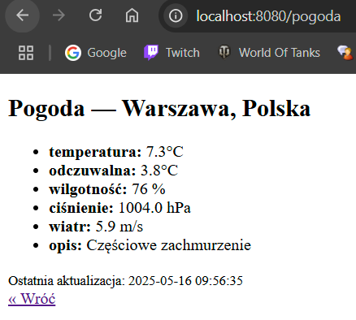

# Zadanie 1 – aplikacja **„Pogodynka”** w kontenerze Docker

**Autor:** Paweł Peterwas
**E‑mail:** [s99658@pollub.edu.pl](mailto:s99658@pollub.edu.pl)

Obraz Docker Hub: [https://hub.docker.com/r/pawloxdocker/pogodynka](https://hub.docker.com/r/pawloxdocker/pogodynka)

---

## 1  Kod aplikacji

```
├── app/
│   └── main.py        ← logika serwera FastAPI
├── templates/         ← dwa proste szablony HTML
│   ├── form.html      ← formularz wyboru lokalizacji
│   └── weather.html   ← wynik z pogodą
├── requirements.txt   ← zależności Pythona
├── .env.example       ← wzór pliku z kluczem API
└── Dockerfile         ← wieloetapowa budowa obrazu
```

### app/main.py

```python
# — konfiguracja i log startowy —
from datetime import datetime
import os, logging, httpx
from dotenv import load_dotenv
from fastapi import FastAPI, Request, Form, HTTPException
from fastapi.responses import HTMLResponse
from fastapi.templating import Jinja2Templates

load_dotenv()   
API_KEY = os.getenv("WEATHERAPI_KEY")
AUTHOR  = "Paweł Peterwas"
PORT    = 8000
logging.basicConfig(level=logging.INFO,
                    format="%(asctime)s | %(levelname)s | %(message)s")
logging.info("Start aplikacji | Autor: %s | PORT: %s", AUTHOR, PORT)

# — instancja aplikacji + szablony —
app = FastAPI(title="Pogodynka")
templates = Jinja2Templates(directory="templates")

# — minimalna lista lokalizacji —
LOC = {
    "Polska": {"code": "PL", "cities": ["Warszawa", "Kraków", "Gdańsk"]},
    "Niemcy": {"code": "DE", "cities": ["Berlin", "Munich", "Hamburg"]},
    "USA":    {"code": "US", "cities": ["New York", "Chicago", "San Francisco"]},
}

# — pobieranie pogody z WeatherAPI —
async def fetch_weather(city: str, code: str) -> dict:
    url = (
        "https://api.weatherapi.com/v1/current.json"
        f"?key={API_KEY}&q={city},{code}&lang=pl"
    )
    async with httpx.AsyncClient(timeout=10) as cli:
        try:
            r = await cli.get(url)
            r.raise_for_status()
        except httpx.HTTPStatusError as exc:
            raise HTTPException(status_code=502, detail=exc.response.text)
    c = r.json()["current"]
    return {
        "temperatura": f"{c['temp_c']} °C",
        "odczuwalna":  f"{c['feelslike_c']} °C",
        "wilgotność":  f"{c['humidity']} %",
        "ciśnienie":   f"{c['pressure_mb']} hPa",
        "wiatr":       f"{c['wind_kph']/3.6:.1f} m/s",
        "opis":        c["condition"]["text"],
    }

# — endpoint formularza —
@app.get("/", response_class=HTMLResponse)
async def form(request: Request):
    return templates.TemplateResponse("form.html", {"request": request, "loc": LOC})

# — endpoint wyniku —
@app.post("/pogoda", response_class=HTMLResponse)
async def show(request: Request, country: str = Form(...), city: str = Form(...)):
    w = await fetch_weather(city, LOC[country]["code"])
    return templates.TemplateResponse("weather.html", {
        "request": request, "city": city, "country": country, "w": w,
        "time": datetime.now().strftime("%Y-%m-%d %H:%M:%S")
    })
```

### templates/form.html

```html
<!-- Formularz wyboru lokalizacji -->
<select id="country" name="country" onchange="sync()">
  <option>{{ n }}</option>
</select>
<select id="city" name="city"></select>
<script>
  const LOC={{ loc|tojson }};
  function sync(){
    const c=document.getElementById('country').value;
    const m=document.getElementById('city');
    m.innerHTML='';
    LOC[c].cities.forEach(x=>m.innerHTML+=`<option>${x}</option>`);
  } sync();
</script>
```

### templates/weather.html

```html
<!-- Wynik pobierania pogody -->
<ul><li><b>{{ k }}:</b> {{ v }}</li></ul>
```

---

## 2  Dockerfile 

```dockerfile
# etap 1 — budujemy koła zależności, żeby wykorzystać cache
FROM python:3.12-slim AS builder
WORKDIR /build
COPY requirements.txt .
RUN pip install --upgrade pip && pip wheel -r requirements.txt -w wheels

# etap 2 — finalny lekki obraz
FROM python:3.12-slim
LABEL org.opencontainers.image.authors="Paweł Peterwas <s99658@pollub.edu.pl>"
ENV PYTHONUNBUFFERED=1 PORT=8000
WORKDIR /app

# instalacja zależności bezpośrednio z kół
COPY requirements.txt .
COPY --from=builder /build/wheels /wheels
RUN pip install --no-index --find-links=/wheels -r requirements.txt && rm -rf /wheels

# kopiujemy kod aplikacji
COPY app ./app
COPY templates ./templates

EXPOSE ${PORT}

# prosty health‑check HTTP 200
HEALTHCHECK CMD ["python","-c","import http.client,os,sys; c=http.client.HTTPConnection('localhost',int(os.getenv('PORT',8000))); c.request('GET','/'); sys.exit(0) if c.getresponse().status<500 else sys.exit(1)"]

ENTRYPOINT ["python","-m","uvicorn","app.main:app","--host","0.0.0.0","--port","8000"]
```

---

## 3  Polecenia CLI

*Budowa obrazu*

```bash
docker build -t pawloxdocker/pogodynka:latest .
```

*Uruchomienie kontenera*

```bash
docker run -d -e WEATHERAPI_KEY=$(grep WEATHERAPI_KEY .env | cut -d= -f2) \
  -p 8080:8000 --name pogodynka pawloxdocker/pogodynka:latest
```

*Log startowy*

```bash
docker logs --tail 20 pogodynka
```

*Warstwy i rozmiar*

```bash
docker image inspect pawloxdocker/pogodynka:latest --format '{{len .RootFS.Layers}} warstw'
docker images pawloxdocker/pogodynka:latest --format '{{.Size}}'
```

---

## 4  Zrzut ekranu działania




